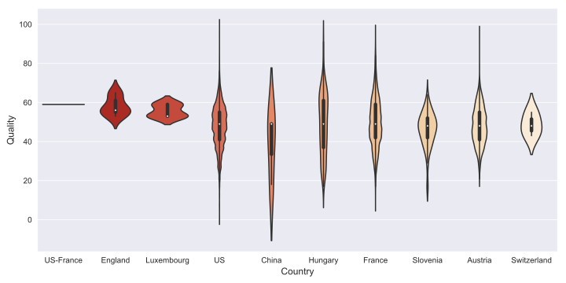

# Wine Quality Prediction

## Problem Overview
The proposed competition is a `Regression Problem` based on a collection of `150,930 wine reviews`, divided into  development set (120,744) and evaluation set 35,716. The aim of the competition is to predict the `quality score`, defined for a given review,  by considering 8 features reported  in Table 1.

All the categorical features present a `wide cardinality domain`, in a range between 49 (country) and 27,801 (designation). Then, both development and evaluation set contain a considerable number of null values. These two aspects must be taken in consideration for the processing phase. In addition to these categorical features, there is the description field, that contains the the textual description of the review. We discovered that there are just 85,005 unique descriptions over a total number of 120,744. Thanks to this insight, we discovered that the development set contains 35,739 duplicates. 

|             | `Development set` |                  | `Evaluation set` |                  |
|-------------|:---------------:|------------------|:--------------:|:----------------:|
|   **Feature**   |   **Cardinality**   | **Null values  (%)** |   **Cardinality**  | **Null values  (%)** |
|   country   |        49       |       0.004      |       40       |         0        |
| designation |      27801      |      30.244      |      11952     |      30.534      |
|   province  |       445       |       0.004      |       342      |         0        |
|   region_1  |       1207      |      16.571      |       949      |      16.736      |
|   region_2  |        19       |      59.637      |       19       |      59.528      |
|   variety   |       603       |         0        |       457      |         0        |
|    winery   |      14105      |         0        |      8962      |         0        |
| description |        -        |         0        |        -       |         0        |
|   quality   |        -        |         0        |        -       |         -        |

Another key aspect regards the predictor `quality`. It is normally distributed on the interval [0,100] (Figure 1), whereas the median 50th percentile lays on 46. In order to detect the outliers, it has been used the `1.5IQR` Rule}, that allows to define the minimum and maximum thresholds beyond which we consider the data points as outliers. 

  

 
 
`Q_1` and `Q_3` are the first and the third quantile, respectively. This technique allowed to discover $4\,972$ outliers. In order to verify if they can be considered as outliers or not, we inspected two random descriptions with quality `0` and `100` : 
 *  0 : "Clean as anyone should reasonably expect given the almost unheard-of price. Drink it now; cook with it; make a sangria with it. Just enjoy it."
 * 100 : "The nose on this single-vineyard wine from a strong, often overlooked appellation is tight and minerally before showing a slightly tropical kiwi element [...]."
 
The difference is not noticeable at all, so we assumed that these "rare" values are probably not reflecting the real quality. It is also interesting that the quality associated to most categorical values has a considerable variance. For example in Figure 2 it is possible to observe the top 15 countries (based on the median quality), and most of them covers a wide range, even if some of them are stretched by the outliers or they have just one review (US_France).

  

 

In addition to the geographical features (country, province, region_1 and region_2), there are other two features strongly related to the wine itself, and they are `winery` and `designation`. Even if the latter has around 30% of null values, it may be still relevant for the prediction.  On the flip side, this strong representativeness is related to a huge cardinality domain, that will affect the overall performances. 

## Proposed Approach

### Data Preprocessing
It has been demonstrated that duplicated values on a regression problem may bias the estimated coefficient and standard errors [1]. So, we decided to drop all the duplicated values on our dataset 35,716 samples). 

Then, we encoded the categorical features. This process is extremely important, especially when it needs to encode considerable categorical domains. So, after some preliminary analysis and thanks to the Cedric and Seger's investigation [2], we decided to use the `OneHotEncoding`  technique, even if it does involve a remarkable slowdown in performances. This is particularly valuable when there is not a strong "ordinal" relationship among the values, because it creates a binary column for each category, as showed in Table 2.

| `country` | `quality` |     >>  | `country_France` |  `country_US` | `quality` |
|-----------|---------|---------|--------------|--------------|--------------|
|   France   |   45.0   | >>  |   1  | 0  | 45.0   |
|   US   |   31.0   | >> |   0  | 1  | 31.0   |
|   US   |   35.0   | >>  |   0  | 1  | 35.0   |

Then, as it can be clearly seen in Table 1,  region_2 contains around `60% of null values`, furthermore we decided to drop it. Then, since `country` and `province` contains just the 0.004%, they have been replaced with the most common attributes on the respective columns. The last two columns with null values are `designation` and `region_1`. They both have a reasonable amount of null values, and because of that, they have been replaced with the sentinel value "other"; otherwise, they would have given too much importance to the most frequent ones.  

Since before we assumed that some target values should be considered as outliers, we analyzed the behaviour of the model. So, we tested the model with outliers and also without them. We can consider them as hyperparameters for the preprocessing step:
* α : removing outliers
* β : not removing outliers

We will discuss it more in detail on the hyperparameter tuning section. Lastly, the description feature required a refined preprocessing, in fact it has been removed from the main data structure and it has been preprocessed separately. The first step regards the `tokenization`, it splits a piece of text into smaller units called tokens. Then, we removed the `stopwords` (most common English words) and for each token we: 
* converted it to `lowercase`
* removed digits and `punctuation`
* removed the grammatical inflections (`lemmatization`)

The lemmatization technique is really effective in Natural Language Processing (`NLP`) problems, because it tries to reproduce the intended meaning, by grouping together similar words, so they can be analysed as a single item. For example `plays,play,playing` will be all considered as `play`. Another similar technique is the `stemming`, that extracts the root (consulting, consult et simila will be transformed in consult). So, the main difference is that the former extract a meaningful reduced word, whereas the latter is interested just on its root form. They present similar performances, even if the stemming is a bit faster.

The weight of each token has been measured with the term frequency-inverse document frequency (TF-IDF), defined as follows:

  

where `t` is the token, `d` is the current document, and `D` is the collection of `m` documents.  The idea of the TF-IDF is to stand out tokens that occur frequently in a single document, but rarely on the entire collections of documents.  In particular, instead of extracting single tokens, we considered the 4-grams, that are subsequences of 4 tokens. In Figure 4 it is showed how the naive TfidfVectorizer (provided by Scikit-learn) works with the following phrases:  
* "love this wine" 
* "hate this wine" 

|      `hate`       | `love` |     `this`            | `wine` |  
|-------------|---------------|------------------|--------------|
|   0.0   |   0.7049   | 0.5015 |   0.5015  | 
|   0.7049   |   0.0   | 0.5015 |   0.5015  | 

### Model Selection
The following algorithms have been tested:
* `Linear Regression` : it is a model that assumes a linear relationship among its features. The prediction is made by computing a weighted sum of the input features and the intercept. 
* `Ridge` :  it is a regularized version of Linear Regression and it forces the learning algorithm to keep the model weights as small as possible. This regularization can be made with the hyperparameter α. If it is very large, all weights end up very close to zero.
* `Stochastic Gradient Descent Regressor (SGD)` : it picks a random instance in the training set at every step and computes the gradients based only on that single istance. Due to its stochasticity, the cost function bounces up and down and slowly converges to the minimum. This randomness is good for escaping from the local optima, but on the other hand it cannot settle at the minimum. This issue can be partially solved by considering the behaviour of the well known simulated annealing algorithm.

For all these regressor models, we found out the best configurations through the grid search approach, as it is explained in the next section. 

### Hyperparameters Tuning
As we mentioned before, we tuned two different sets of hyperparameters, one for the preprocessing task (α, β) and the other one for the prediction models (Table 3). 

| **Model**  | **Hyperparameters** | **Values**  | 
| ------------- | ------------- | ------------- | 
| Linear Regression | fit_intercept   normalize |  {True,False}   {True,False} | 
| Ridge | alpha | {0.01,0.1,1,10} |
| SGDRegressor |  loss   penalty   alpha   eta0 | {'squared_loss'}   {'l1','l2'}   {1e-5, ... , 1}   {0.01,1} |

Firstly, we analyzed the performances of α and β with all the regressors with their naive configuration by means of the R2 score. Once we found the apparently best preprocessing, it is possible to tune the models. The best configuration can be found by using the `Grid Search Cross Validation` technique that works as follows : 

* Generates all the possible candidates that needed to be trained.
* Train and test each configuration with a Cross Validation approach (k = 3 in our case).
* Select the best configuration.

## Results
From the comparison among the two preprocessing proposed (α = with outliers, β = without outliers) seems that removing the outliers affects the overall performances of all the tested regressors (mean of 0.745 vs 0.72). So, all the model presented in the previous section have been tuned without removing the outliers (β). The best configurations of hyperparameters with their results obtained in the public score can be visualized in Table 3. 
`Ridge outperformed` both Linear Regression and SGD on the public score with `0.881` against 0.880 and 0.856, respectively. These results have been compared with a `naive solution` defined by the encoding of the cateogorical features and without considering duplicated, outliers and the description field. This one obtained 0.828 on the public score. 

| **Model**  | **Best Hyperparameters** | **Public Score**  | 
| ------------- | ------------- | ------------- | 
| Linear Regression | fit_intercept  = True   normalize = False |  0.880 | 
| Ridge | alpha = 0.01 | 0.881 |
| SGDRegressor |  loss = 'squared_loss'   penalty = 'l1'   alpha = 1e-5   eta0 = 0.1 | 0.856 |

## Discussion
The current approach obtains an overall satisfactory result, `outperforming the proposed baseline`. In particular, removing the duplicates and managing the textual field has strongly influenced the performances. Further considerations can be made by reducing the `categorical domains`. It can be performed by iteratively removing subset of less frequent categorical attributes. Then, it may be helpful to reduce the overall size of the final data structure with the fairly well known `Principal Component Analysis`. It would require multiple tests, in order to analyze the performances with a decreasing number of components. Then, as we saw, the description feature has turned out to be fundamental for boosting the performances, so another key aspect for further improvements regards the textual preprocessing. It would be relevant to try several other different ways for preprocess it. In fact, without removing the punctuation and the non-alphabetical characters we noticed an improvement on the performances (0.882 on the public score), even if avoiding these important steps should add just "noise". 

  

[1]  Sarracino, Mikucka, 'Bias and efficiency loss in regression estimates due to duplicated observations: a Monte Carlo simulation'  
[2]  Seger, Cedric , 'An investigation of categorical variable encoding techniques in machine learning: binary versus one-hot and feature hashing'  

 

EDA : https://github.com/francescodisalvo05/wine-quality-prediction/blob/main/EDA.ipynb  
Modeling : https://github.com/francescodisalvo05/wine-quality-prediction/blob/main/code_s282418.ipynb  
Report : https://github.com/francescodisalvo05/wine-quality-prediction/blob/main/report_s282418.pdf  
